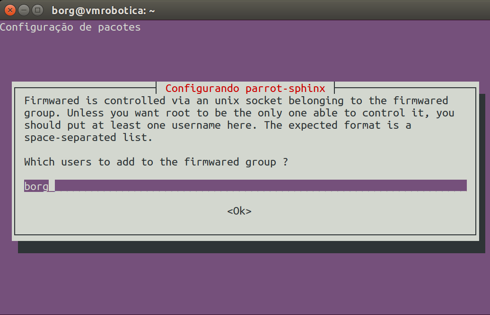
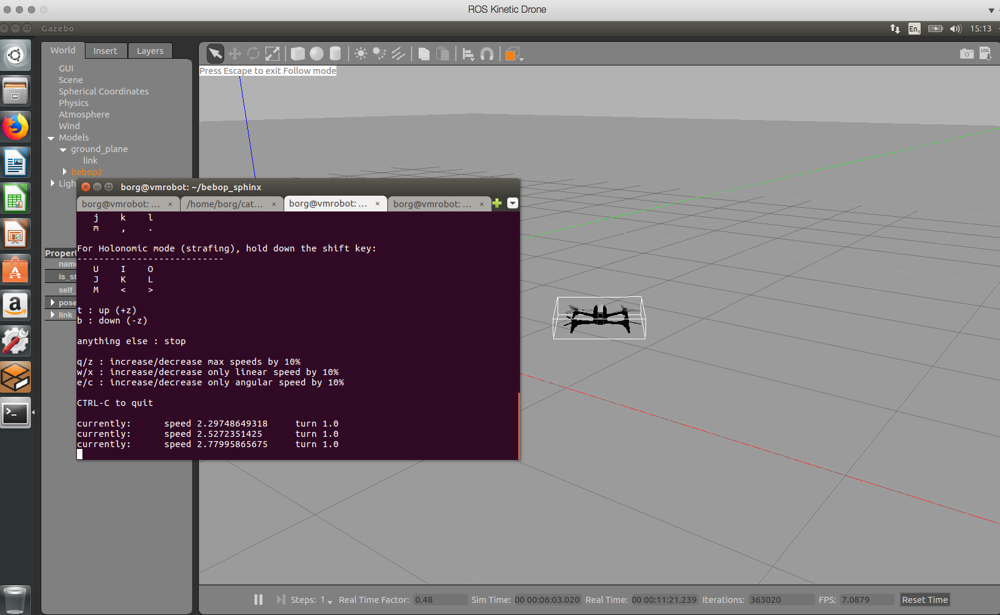

# Instruções para executar o ROS com o Sphinx

## Instalar Sphinx

[Fonte:](https://developer.parrot.com/docs/sphinx/firststep.html)

Adicionar o repo

    echo "deb http://plf.parrot.com/sphinx/binary `lsb_release -cs`/" | sudo tee /etc/apt/sources.list.d/sphinx.list > /dev/null


Adicionar a chave criptográfica para abrir o software

    sudo apt-key adv --keyserver keyserver.ubuntu.com --recv-keys 508B1AE5


Atualizar

    sudo apt-get update

Instalar

    sudo apt-get install parrot-sphinx
    
Vamos também instalar as `mesa-utils`

    sudo apt-get install mesa-utils

Adicionar usuário atual ao firmwared group na caixa de diálogo. Pode ser o `borg` , se forem os pen drives ou VMs do Miranda.




Fazer logout e login para as permissões de firmwared funcionarem

Reiniciar o firmwared

    sudo systemctl start firmwared.service

Verificar se o firmwared está funcionando:

    fdc ping

Deve responder **PONG**.

Note que o `firmwared` precisa ser reiniciado **toda vez**.


Edite o arquivo `bebop2.drone` Ipara desabilitar a câmera virtual (por enquanto) e desabiliar o wi-fi real.

Use o `gedit` ou seu editor favorito:

    gedit opt/parrot-sphinx/usr/share/sphinx/drones/bebop2.drone


Os conteúdos deverão ficar assim:

```xml
<?xml version="1.0" encoding="UTF-8"?>
<drone
  name="bebop2"
  firmware="http://plf.parrot.com/sphinx/firmwares/ardrone3/milos_pc/4.0.6/images/ardrone3-milos_pc.ext2.zip"
  hardware="milosboard">
  <machine_params
    low_gpu="true"
    with_front_cam="false"
    with_hd_battery="false"
    with_flir="false"
    flir_pos="tilted"/>
  <pose>default</pose>
  <interface>eth1</interface>
</drone>
```

Salve o arquivo. 


Para iniciar o simulador:

    sphinx /opt/parrot-sphinx/usr/share/sphinx/drones/bebop2.drone 

Para iniciar o simulador com um cenário, execute:

sphinx /opt/parrot-sphinx/usr/share/sphinx/worlds/outdoor_2.world /opt/parrot-sphinx/usr/share/sphinx/drones/bebop2.drone

**Obs.:** A versão com cenário só funciona bem fora de máquinas virtuais.


Aguarde cerca de 1 minuto da primeira vez que abrir o Sphinx num cenário ou modelo de drone novo. Alguns arquivos são baixados da Internet sob demanda. 


# bebop_autonomy

Vamos nos assegurar que o pacote `bebop_autonomy`, que faz o ROS ter acesso ao drone está instalado.

    cd ~/catkin_ws/src
    ls

Você deve ver uma pasta chamada `bebop_autonomy` . Se você não vir, execute o guia de conexão ao Bebop e retorne a este ponto.


Para conectar o bebop_autonomy ao Bebop2 virtual, precisamos saber qual é o endereço IP do drone virtual. Ele segue o formato `10.202.X.1`.  `X` começa sempre em `0` e vai sendo incrementado toda vez que se reinicia o *Sphinx* dentro de um mesmo boot. Da primeira vez o endereço será `10.202.0.1`. Vamos confirmar:

    ping 10.202.0.1

A resposta deverá ser assim:

    PING 10.202.0.1 (10.202.0.1) 56(84) bytes of data.
    64 bytes from 10.202.0.1: icmp_seq=1 ttl=64 time=0.033 ms
    64 bytes from 10.202.0.1: icmp_seq=2 ttl=64 time=0.023 ms
    64 bytes from 10.202.0.1: icmp_seq=3 ttl=64 time=0.029 ms

Uma vez confirmado que o endereço do drone é de fato `10.202.0.1`, vamos instruir o ROS para se conectar a este drone virtual:

    roslaunch bebop_driver bebop_node.launch ip:=10.202.0.1

A conexão deve ter sido feita. Alguns erros no terminal são normais porque ainda estamos operando com a câmera simulada do drone desligada.


Para fazer a decolagem, use o comando:

    rostopic pub --once bebop/takeoff std_msgs/Empty

Pronto! A partir de agora vocês podem rodar qualquer código em Python ou rodar o `teleop` :

    rosrun teleop_twist_keyboard teleop_twist_keyboard.py cmd_vel:=bebop/cmd_vel





# Observações:

Para fazer um *cleanup* geral, depois que fechar o *Sphinx*, rode estes comandos:

    fdc drop_all instances
    fdc drop_all firmwares
    rm /dev/shm/shd_*
    sudo systemctl stop firmwared.service
    sudo rm /usr/share/firmwared/firmwares/*


gedit 